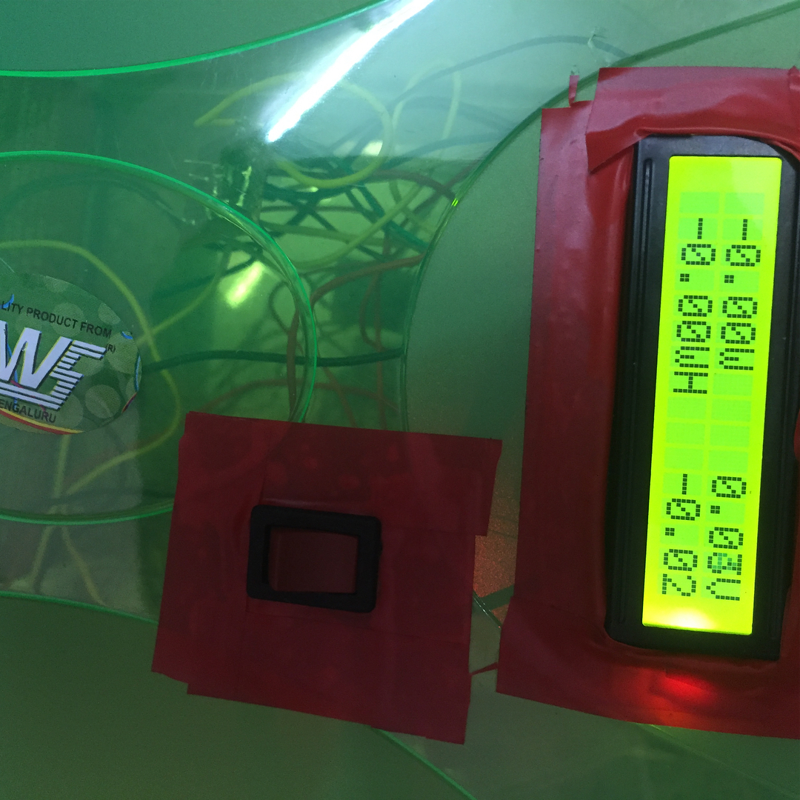

# Smart-Inverter

Phase 1- Getting the Voltage/Current/Power readings ✅
Phase 2- Uploading the data to internet and Remote Monitoring
Phase 3- Going Off Grid (Only Solar)

I screwed a UNO. All the analog Pins were reading wrong values had to use a Spare one. RIP Arduino UNO R3( 5:00 PM 2017/08/01 - 2:47 AM 2017/08/02)

